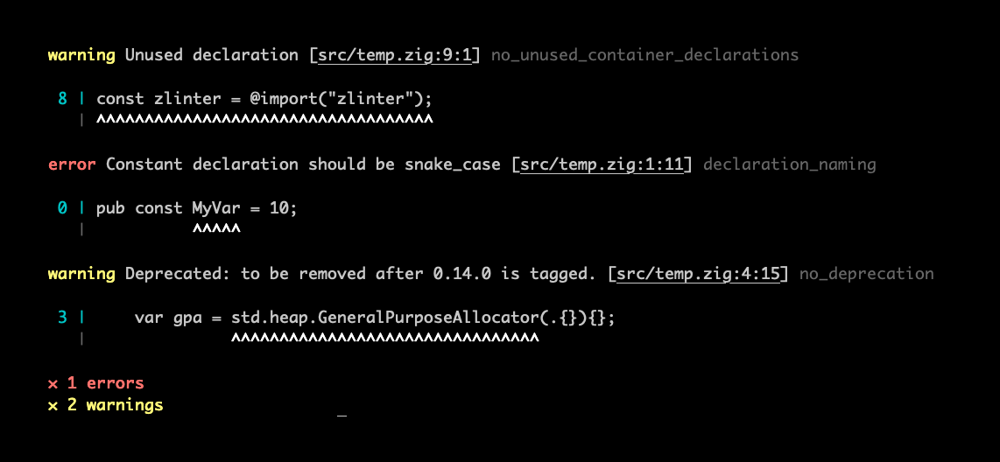

# Zlinter - Linter for Zig

[](https://github.com/KurtWagner/zlinter/actions/workflows/linux.yml)
[](https://github.com/KurtWagner/zlinter/actions/workflows/windows.yml)
[](https://coveralls.io/github/KurtWagner/zlinter?branch=0.14.x)
[](https://opensource.org/licenses/MIT)

An extendable and customizable **Zig linter** that is integrated from source into your `build.zig`.

> [!TIP]
> While Zig is `0.x.x`,  **`no_deprecated`** is important - it will do best effort to **report the usage of deprecated and removed zig features**.

> [!NOTE]
> **2025-07-03:** `zlinter` is **new**.  
>
> - Expect breaking changes between commits.  
> - Some features may not work as documented.  
>
> Please report issues and contribute fixes!



## Table of contents

- [Background](#background)
- [Versioning](#versioning)
- [Features](#features)
- [Getting Started](#getting-started)
- [Configuration](#configuration)
  - [Paths](#configure-paths)
  - [Rules](#configure-rules)
  - [Disable with Comments](#disable-with-comments)
  - [Command-Line Arguments](#command-line-arguments)
  - [Custom Rules](#custom-rules)
  - [Optimization](#configure-optimization)
- [Built-in Rules](RULES.md)
  - [declaration_naming](RULES.md#declaration_naming)
  - [field_naming](RULES.md#field_naming)
  - [file_naming](RULES.md#file_naming)
  - [function_naming](RULES.md#function_naming)
  - [max_positional_args](RULES.md#max_positional_args)
  - [no_deprecated](RULES.md#no_deprecated)
  - [no_hidden_allocations](RULES.md#no_hidden_allocations)
  - [no_inferred_error_unions](RULES.md#no_inferred_error_unions)
  - [no_literal_args](RULES.md#no_literal_args)
  - [no_orelse_unreachable](RULES.md#no_orelse_unreachable)
  - [no_panic](RULES.md#no_panic)
  - [no_swallow_error](RULES.md#no_swallow_error)
  - [no_undefined](RULES.md#no_undefined)
  - [no_unused](RULES.md#no_unused)
  - [require_doc_comment](RULES.md#require_doc_comment)
  - [switch_case_ordering](RULES.md#switch_case_ordering)
- [Contributing](#contributing)
  - [How to Contribute](#contributions)
  - [Run tests](#run-tests)
  - [Run on self](#run-lint-on-self)

## Background

`zlinter` was written to be used across my personal projects. The main motivation was to have it integrated from source through a build step so that it can be

1. customized at build time (e.g., byo rules); and
2. versioned with your projects source control (no separate binary to juggle)

I'm opening it up incase it's more generally useful, and happy to let it
organically evolve around needs, if there's value in doing so.

It uses [`zls`](https://github.com/zigtools/zls) (an awesome project, go check it out if you haven't already) and `std.zig` to build and analyze zig source files.

## Versioning

`zlinter` will:

- follow the same semantic versioning as `zig`;
- use branch `master` for `zig` `master` releases; and
- use branch `0.14.x` for `zig` `0.14.x` releases.

This may change, especially when `zig` is "stable" at `1.x`. If you have opinions on this, feel free to comment on [#20](https://github.com/KurtWagner/zlinter/issues/20).

## Features

- [x] [Integrates from source into your `build.zig`](#getting-started)
- [x] [Builtin rules](RULES.md) (e.g., [`no_deprecated`](RULES.md#no_deprecated) and [`field_naming`](RULES.md#field_naming))
- [x] [Custom / BYO rules](#custom-rules) (e.g., if your project has bespoke rules you need to follow)
- [x] [Per rule configurability](#configure-rules) (e.g., deprecations as warnings)
- [x] Auto-fix with `--fix` capability (e.g., `no_unused` can remove unused container declarations)
- [ ] Interchangeable result formatters (e.g., json, checkstyle)

## Getting started

`zlinter` is not a standalone binary - it's built into your projects `build.zig`.
This makes it flexible to each projects needs. Simply add the dependency and
hook it up to a build step, like `zig build lint`:

1. Save dependency to your zig project:

    ```shell
    # For 0.14.x
    zig fetch --save git+https://github.com/kurtwagner/zlinter#0.14.x

    # OR
    
    # For master (0.15.x-dev)
    zig fetch --save git+https://github.com/kurtwagner/zlinter#master
    ```

1. Configure `lint` step in your `build.zig`:

    ```zig
    const zlinter = @import("zlinter");
    // ...
    const lint_cmd = b.step("lint", "Lint source code.");
    lint_cmd.dependOn(step: {
        // Swap in and out whatever rules you see fit from RULES.md
        var builder = zlinter.builder(b, .{});
        builder.addRule(.{ .builtin = .field_naming }, .{});
        builder.addRule(.{ .builtin = .declaration_naming }, .{});
        builder.addRule(.{ .builtin = .function_naming }, .{});
        builder.addRule(.{ .builtin = .file_naming }, .{});
        builder.addRule(.{ .builtin = .switch_case_ordering }, .{});
        builder.addRule(.{ .builtin = .no_unused }, .{});
        builder.addRule(.{ .builtin = .no_deprecated }, .{});
        builder.addRule(.{ .builtin = .no_orelse_unreachable }, .{});
        builder.addRule(.{ .builtin = .max_positional_args }, .{});
        break :step builder.build();
    });
    ```

1. Run linter:

    ```shell
    zig build lint

    // OR be specific with paths
    zig build lint -- --include src/ file.zig
    ```

## Configuration

### Configure paths

The builder used in `build.zig` has a method `addPaths`, which can be used to
add included and excluded paths. For example,

```zig
builder.addPaths(.{
    .include = &.{ "engine-src/", "src/" },
    .exclude = &.{ "src/android/", "engine-src/generated.zig" },
});
```

would lint zig files under `engine-src/` and `src/` except for `engine-src/generated.zig` and any zig files under `src/android/`.

### Configure Rules

`addRule` accepts an anonymous struct representing the `Config` of rule being added. For example,

```zig
builder.addRule(.{ .builtin = .field_naming }, .{
  .enum_field = .{ .style = .snake_case, .severity = .warning },
  .union_field = .off,
  .struct_field_that_is_type = .{ .style = .title_case, .severity = .@"error" },
  .struct_field_that_is_fn = .{ .style = .camel_case, .severity = .@"error" },
});
builder.addRule(.{ .builtin = .no_deprecated }, .{
  .severity = .warning,
});
```

where `Config` struct are found in the rule source files [`no_deprecated.Config`](./src/rules/no_deprecated.zig) and [`field_naming.Config`](./src/rules/field_naming.zig).

### Disable with comments

#### `zlinter-disable-next-line [rule_1] [rule_n] [- comment]`

Disable all rules or an explicit set of rules for the next source code line. For example,

```zig
// zlinter-disable-next-line no_deprecated - not updating so safe
const a = this.is.deprecated();
```

#### `zlinter-disable-current-line [rule_1] [rule_n] [- comment]`

Disable all rules or an explicit set of rules for the current source code line. For example,

```zig
const a = this.is.deprecated(); // zlinter-disable-current-line
```

### Command-Line Arguments

```shell
zig build lint -- [--include <path> ...] [--exclude <path> ...] [--filter <path> ...] [--rule <name> ...] [--fix]
```

- `--include` run the linter on these path ignoring the includes and excludes defined in the `build.zig` forcing these paths to be resolved and linted (if they exist).
- `--exclude` exclude these paths from linting. This argument will be used in conjunction with the excludes defined in the `build.zig` unless used with `--include`.
- `--filter` used to filter the run to a specific set of already resolved paths. Unlike `--include` this leaves the includes and excludes defined in the `build.zig` as is.
- `--fix` used to automatically fix some issues (e.g., removal of unused container declarations) - **Only use this feature if you use source control as it can result loss of code!**

For example

```shell
zig build lint -- --include src/ android/ --exclude src/generated.zig --rule no_deprecated no_unused
```

- Will resolve all zig files under `src/` and `android/` but will exclude linting `src/generated.zig`; and
- Only rules `no_deprecated` and `no_unused` will be ran.

### Custom rules

Bespoke rules can be added to your project. For example, maybe you really don't like cats, and refuse to let any `cats` exist in any identifier. See example rule [`no_cats`](./integration_tests/src/no_cats.zig), which is then integrated like builtin rules in your `build.zig`:

```zig
builder.addRule(b, .{ 
  .custom = .{
    .name = "no_cats",
    .path = "src/no_cats.zig",
  },
}, .{});
```

Alternatively, take a look at <https://github.com/KurtWagner/zlinter-custom-rule-example>, which is a minimal custom rule example with accompanying zig project.

### Configure Optimization

`zlinter.builder` accepts `.optimize` (defaults to `.Debug`). For example,

```zig
var builder = zlinter.builder(b, .{.optimize = .ReleaseFast });
```

If your project is large it may be worth setting optimize to `.ReleaseFast` - keep in mind the first run may be slower as it builds the the modules for the first time with the new optimisation.

## Contributing

### Contributions

Contributions and new rules or formatters are very welcome.

Rules are per project configurable so I don't see any problems if new opinionated ones are added (assuming they're not completely bespoke).

If you notice breaking changes in `zig` that will not be picked up by a `Deprecated:` comment then consider contributing to the `no_deprecated.zig` rule, with a specific check for the change. For example, `zig` removed `usingnamespace` in `0.15` so `no_deprecated.zig` will explicitly check and report the usage of `usingnamespace` keyword in `0.14` runs.

### Run tests

Unit tests:

```shell
zig build unit-test
```

Integration tests:

```shell
zig build integration-test
```

All tests:

```shell
zig build test
```

### Run lint on self

```shell
zig build lint
```

### Regenerate documentation

```shell
zig build docs
```
